# Manual de Usuario: Sistema de Gestión de Empleados y Proyectos

## Índice
1. [Introducción](#introducción)
2. [🚪 Iniciar Sesión](#iniciar-sesión)
3. [📂 Cargar Datos de Empleados](#cargar-datos-de-empleados)
4. [📂 Cargar Datos de Proyectos y Tareas](#cargar-datos-de-proyectos-y-tareas)
5. [🔍 Filtrar Tareas de Empleado](#filtrar-tareas-de-empleado)
6. [🚪 Cerrar Sesión](#cerrar-sesión)

## Introducción
Bienvenido al manual de usuario del Sistema de Gestión de Empleados y Proyectos. Este sistema le permite gestionar empleados, proyectos y tareas asociadas de manera eficiente. A continuación, encontrará una guía detallada para utilizar todas las funcionalidades de la aplicación.

## 🚪 1. Iniciar Sesión
Para comenzar, inicie sesión en la aplicación utilizando sus credenciales proporcionadas.

**Procedimiento:**
1. Ingrese su nombre de usuario y contraseña en los campos correspondientes.
2. Haga clic en el botón "Iniciar sesión".
3. Se abrirá la interfaz principal de la aplicación.
4. Podra ingresar el usuario y contraseña por para el administrador si ya se cargo dentro estan cargados en memoria empleados podra ingresar el id y la Constraseña del empleado para acceder a su panel. 

    <H5>INICIO DE CESION CON AMINISTRADOR</H5>
  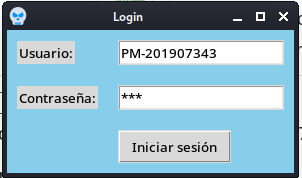
  <H5>INICIO DE CESION CON AMINISTRADOR</H5>
  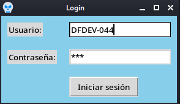

6. Si no existen las credenciales se mostrara un error

  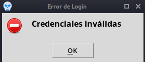

7. Si las creadenciales estan correctas se mostrara un mensaje indicando que todo esta bien, posterior a darle aceptar al mensaje se motrarara el panel del administrador o empleado dependiendo de cuales creadeciales ingreso en el login.

  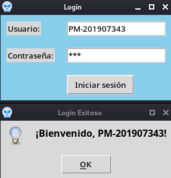

## 📂 2. Cargar Datos de Empleados en el panel de Aministrador
Puede cargar datos de empleados desde un archivo CSV.

  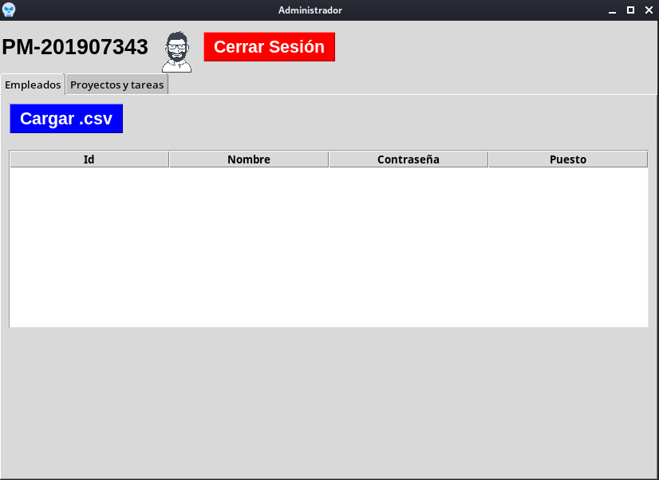

**Procedimiento:**
1. Haga clic en el botón "Cargar .csv".
2. Seleccione el archivo CSV que contiene los datos de los empleados.

  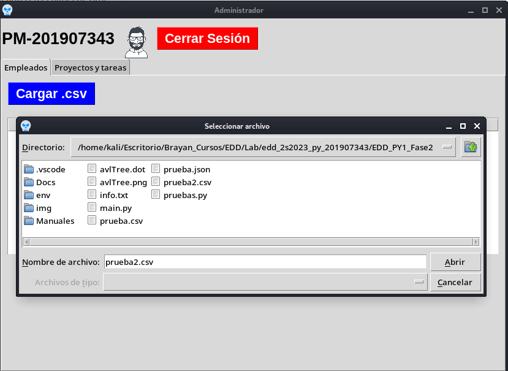

3. Los empleados se cargarán en la tabla de empleados en la pestaña correspondiente.

  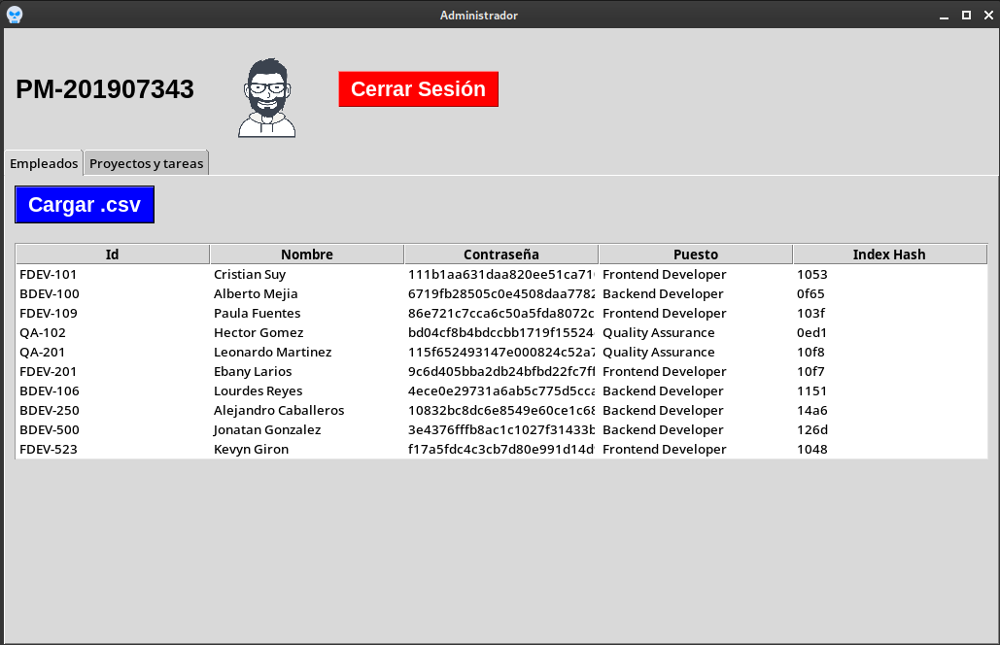

## 📂 3. Cargar Datos de Proyectos y Tareas en el panel de Aministrador
Puede cargar datos de proyectos y tareas desde un archivo JSON.

  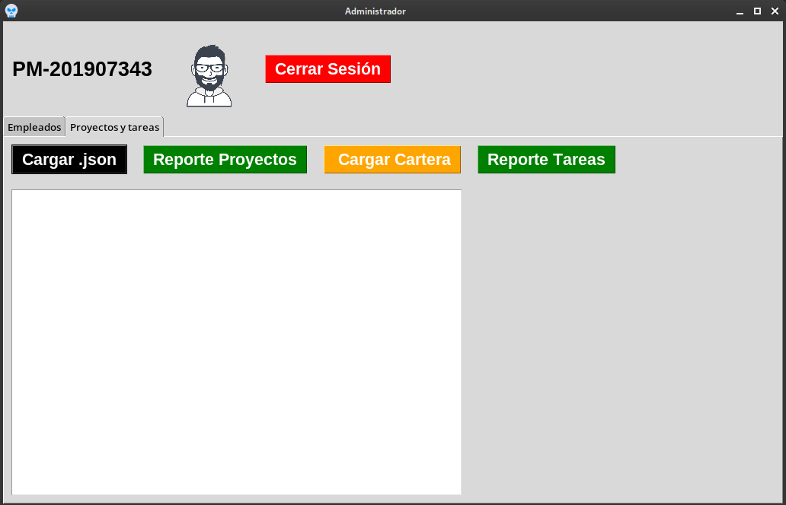

**Procedimiento:**
1. Haga clic en el botón "Cargar .json".
2. Seleccione el archivo JSON que contiene los datos de proyectos y tareas.

  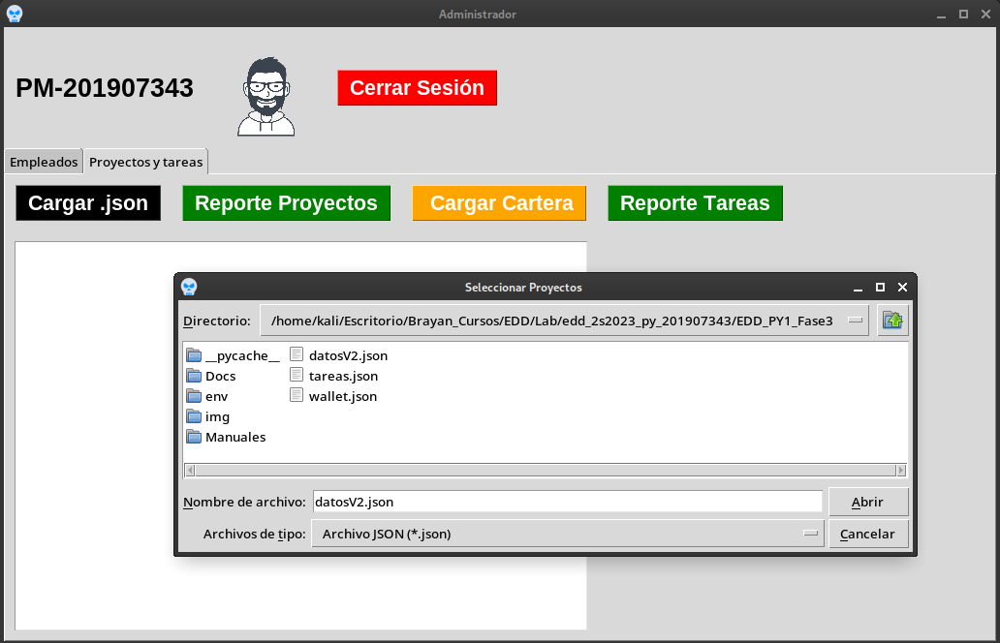

3. Los proyectos y tareas se mostrarán en la interfaz.

  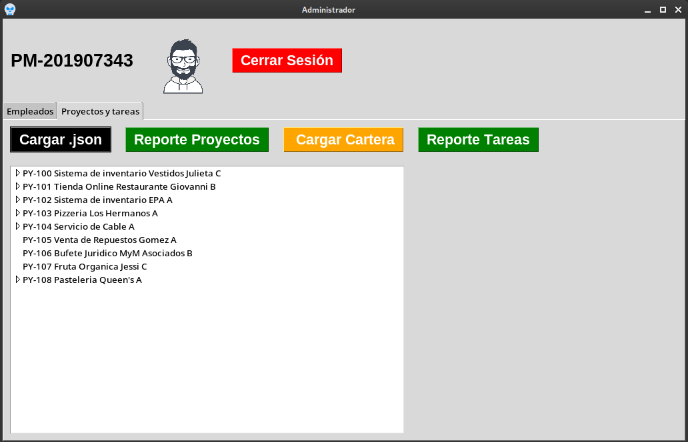

## 🔍 4. Filtrar Tareas de Empleado desde la venta de Empleados
Puede filtrar las tareas de un empleado seleccionando una opción en el Combobox.

  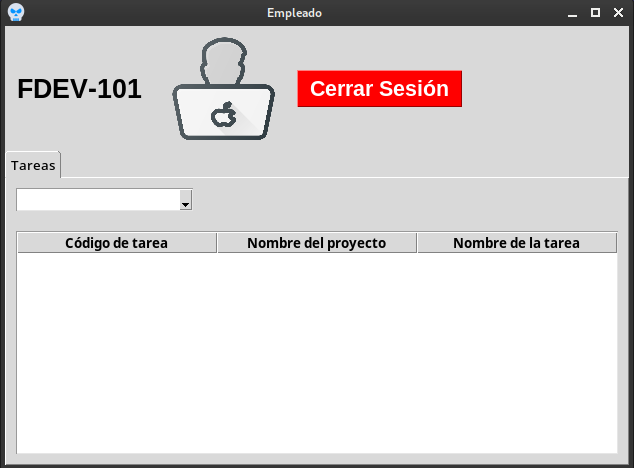

**Procedimiento:**
1. Seleccione una opción en el Combobox.
2. Se mostrará un mensaje con la opción seleccionada.

  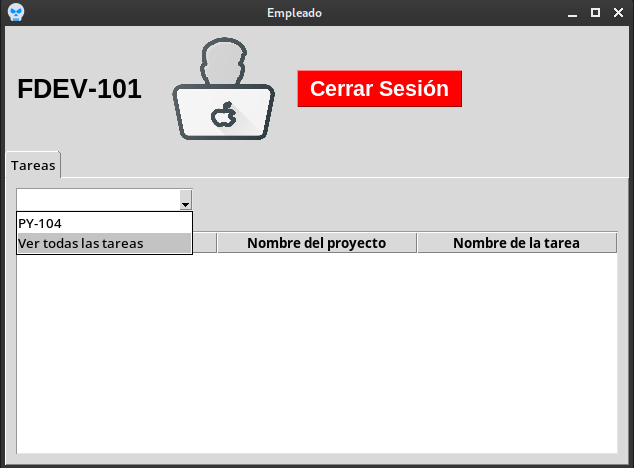

## 🚪 5. Cerrar Sesión
Puede cerrar sesión en la aplicación en cualquier momento tanto en el panel del administrador o el panel de empleado.

**Procedimiento:**
1. Haga clic en el botón "Cerrar Sesión".
2. Se cerrará la sesión actual y volverá a la pantalla de inicio de sesión.

    <H5>Cerrar Sesion en el panel del Administardor</H5>
  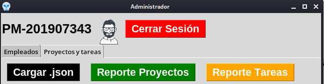
  <H5>Cerrar Sesion en el panel del Empleado</H5>
  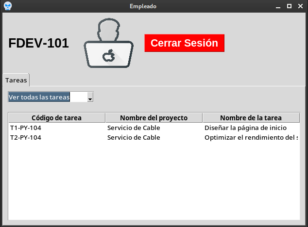

## Conclusión
¡Felicidades! Ha completado el manual de usuario del Sistema de Gestión de Empleados y Proyectos. Ahora está listo para utilizar todas las funciones de la aplicación de manera eficiente.

¡Gracias por utilizar nuestro sistema!
